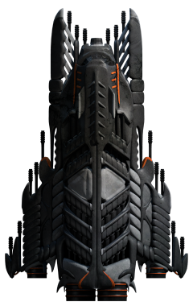
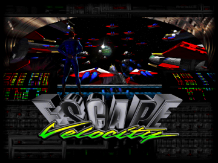
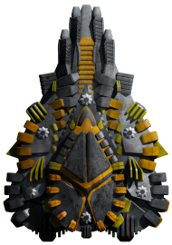
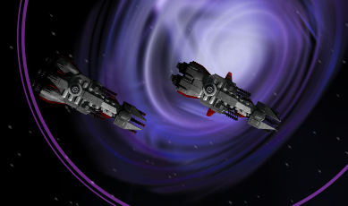
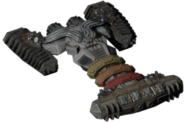
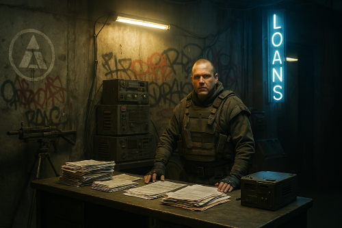
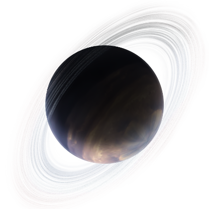
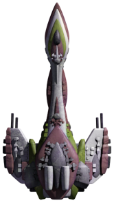
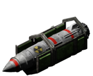
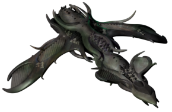

# **YouKnowWhos colletion of endless-sky-plugins**

These plugins were made to continue MZ's original vision for the game. They are designed to be as balanced as the vanilla content and integrate seamlessly with it. 
 
Last tested with the continuous release from 13 April 2025.
 

## Latest News:
<table><tr><td> 2025-04-18 | update: QuargPortals this is a test for news 
2025-04-17 | update: PugGalaxyContent 
2025-04-17 | update: PredecessorGasGiant 
2025-04-17 | credits updated for images in PirateStart and EscapeVelocity 
2025-04-17 | update: PredecessorGasGiant, new two epilogue encounters 
2025-04-16 | licenses updated, notably PredecessorGasGiant is not MIT 
2025-04-16 | update: PredecessorGasGiant code style fixes from closed PR 
2025-04-15 | update: PirateStart small bugfix 
2025-04-15 | PredecessorGasGiant small fixes backported from the PR 
2025-04-15 | replaced about.txt with plugin.txt 
 </td></tr></table>

## Plugin List: 
<table><tr valign="top"><td> 
<a href="README.md#BunrodeaRebellion">BunrodeaRebellion</a> 
<a href="README.md#EscapeVelocity">EscapeVelocity</a> 
<a href="README.md#HaiExtension">HaiExtension</a> 
<a href="README.md#HumanExtension">HumanExtension</a> 
 </td><td> 
<a href="README.md#KorathInBunrodeaSpace">KorathInBunrodeaSpace</a> 
<a href="README.md#PirateStart">PirateStart</a> 
<a href="README.md#PredecessorGasGiant">PredecessorGasGiant</a> 
<a href="README.md#PugGalaxyContent">PugGalaxyContent</a> 
 </td><td> 
<a href="README.md#QuargPortals">QuargPortals</a> 
<a href="README.md#ReloadableNukes">ReloadableNukes</a> 
<a href="README.md#RemantSwan">RemantSwan</a> 
 </td></tr></table>

---

### BunrodeaRebellion

 

[BunrodeaRebellion.zip](https://github.com/geojak/YouKnowWho-s-ES-Plugins/releases/download/v1.0.4-BunrodeaRebellion/BunrodeaRebellion.zip) | 118.0 kb | 2025-05-13 | [view files](https://github.com/geojak/YouKnowWho-s-ES-Plugins/tree/main/myplugins/BunrodeaRebellion/) | <a href="res/imagemd/BunrodeaRebellion.md">view images</a> [1] 
 
>The Megasa have endured oppression under the Tyrant Queen for too long. Now, rebellion burns across the stars. Will you fight for freedom or uphold the throne? Choose your side in the Bunrodea Civil War.

:blue_book: Plugin readme

<blockquote>This plugin introduces a branching civil war event to the Bunrodea faction, where players must choose between supporting the rebel Megasa or the ruling Queen's forces.

Rebel fleets spawn across 12 systems

Two possible outcomes: Rebel victory, partial Royalist suppression

Dominate planets to unlock their outfitters and shipyards
</blockquote>

 

---

### EscapeVelocity

 

[EscapeVelocity.zip](https://github.com/geojak/YouKnowWho-s-ES-Plugins/releases/download/v1.0.4-EscapeVelocity/EscapeVelocity.zip) | 124.59 kb | 2025-04-17 | [view files](https://github.com/geojak/YouKnowWho-s-ES-Plugins/tree/main/myplugins/EscapeVelocity/) | <a href="res/imagemd/EscapeVelocity.md">view images</a> [1] 
 
>Have you ever felt the game is a bit fast? You jump into a system and die in seconds, or you pick a fight only for more enemys to jump in? This plugins fixes that!

:blue_book: Plugin readme

<blockquote>In gamerules.txt the following settings are set:

"system departure min" 4000.

The minimum departure distance for all systems. A ship can only jump out of a system if it is further from the system center than the departure distance. If a system has a defined departure distance greater than this value, that value will be used instead.

"system arrival min" 4500.

The minimum arrival distance for all systems. Ships entering a system will exit hyperspace this distance away from their landing target, or the system center if no landing target is selected. If a system has a defined arrival distance greater than this value, that value will be used instead.

"fleet multiplier" 0.75

The global fleet spawn rate multiplier. A value of 2.0 means twice as many random fleets spawn in all systems, while a value of 0.5 means half as many fleets spawn.

	

</blockquote>

 

---

### HaiExtension

 

[HaiExtension.zip](https://github.com/geojak/YouKnowWho-s-ES-Plugins/releases/download/v1.0.1-HaiExtension/HaiExtension.zip) | 117.42 kb | 2025-04-13 | [view files](https://github.com/geojak/YouKnowWho-s-ES-Plugins/tree/main/myplugins/HaiExtension/) | <a href="res/imagemd/HaiExtension.md">view images</a> [2] 
 
>Collection of small improvements to the hai, that are meant to fit into vanilla so seamlessly, you won't even notice.

:blue_book: Plugin readme

<blockquote>This Plugin reenables Hai Reveal!

Additionally the unfettered hai start using their vanilla prototype weapons Ionic Blaster, Ionic Turret and Ionic Shredder during the wanderer invasion. Unfettered start using the modified Ladybug during Hai Reveal.

You can steal a Unfettered military ID by boarding unfettered hai ships in wanderer space or continue to trade jump drives to the Unfettered even after you have helped the Wanderers.
</blockquote>

 

---

### HumanExtension

 

[HumanExtension.zip](https://github.com/geojak/YouKnowWho-s-ES-Plugins/releases/download/v1.0.2-HumanExtension/HumanExtension.zip) | 378.58 kb | 2025-04-15 | [view files](https://github.com/geojak/YouKnowWho-s-ES-Plugins/tree/main/myplugins/HumanExtension/) | <a href="res/imagemd/HumanExtension.md">view images</a> [5] 
 
>Collection of small improvements to human space, that are meant to fit into vanilla so seamlessly, you won't even notice.

:blue_book: Plugin readme

<blockquote>Added unused vanilla ships to the game:

Nighthawk, Waverider, Valkyrie, Modified Osprey, Modified Vanguard

You will see more pirate fleet variants.

!!This plugin contains zuckungs Kestrel.Unlocks!!
</blockquote>

 

---

### KorathInBunrodeaSpace

 

[KorathInBunrodeaSpace.zip](https://github.com/geojak/YouKnowWho-s-ES-Plugins/releases/download/v1.0.3-KorathInBunrodeaSpace/KorathInBunrodeaSpace.zip) | 53.85 kb | 2025-04-16 | [view files](https://github.com/geojak/YouKnowWho-s-ES-Plugins/tree/main/myplugins/KorathInBunrodeaSpace/) | <a href="res/imagemd/KorathInBunrodeaSpace.md">view images</a> [1] 
 
>Not even the Bunrodea are safe from Korath raids...

:blue_book: Plugin readme

<blockquote>Adds minables to Eneva Katta and Genta Bo.

Thshybo Le, Shini Bori, Genta Bo, and Eneva Katta are now frequented by the Korath.

The more northern Bunrodea systems towards the core are not getting raided, due to the Archons blocking the way.
</blockquote>

 

---

### PirateStart

 

[PirateStart.zip](https://github.com/geojak/YouKnowWho-s-ES-Plugins/releases/download/v1.0.8-PirateStart/PirateStart.zip) | 574.23 kb | 2025-04-18 | [view files](https://github.com/geojak/YouKnowWho-s-ES-Plugins/tree/main/myplugins/PirateStart/) | <a href="res/imagemd/PirateStart.md">view images</a> [2] 
 
>Life in crime is tough, can you make it?

:blue_book: Plugin readme

<blockquote>Pirate Origin Story

- Start as a debt-ridden outlaw from collapsed CCOR space

- $3M starting credits with crushing 0.5% daily interest loan

- Pre-set negative reputations with lawful factions

Escape Routes from Crime

Path A: Free World Pirate Rehabilitation Program

Path B: Acquire Fake ID 

- available from northern pirates after having finished the FW campaign

- Dangerous transaction with intercepting Alpha fleet
</blockquote>

 

---

### PredecessorGasGiant

 

[PredecessorGasGiant.zip](https://github.com/geojak/YouKnowWho-s-ES-Plugins/releases/download/v1.0.12-PredecessorGasGiant/PredecessorGasGiant.zip) | 169.14 kb | 2025-04-17 | [view files](https://github.com/geojak/YouKnowWho-s-ES-Plugins/tree/main/myplugins/PredecessorGasGiant/) | <a href="res/imagemd/PredecessorGasGiant.md">view images</a> [2] 
 
>Adds an ancient Predecessor station in the clouds of a gas giant. Will you open Pandora's box?

:blue_book: Plugin readme

<blockquote>Adds a new narrative-driven storyline centered around a long-forgotten Predecessor refinery hidden deep within the storms of a gas giant. What begins as an ambitious technology experiment slowly unravels into a rediscovery of ancient danger.

Adds 1 new landable gas giant (Avasaa-Aa-Tej) in Predecessor space, long obscured by dense, unstable atmosphere.

- Introduces 9 new story missions that follow your involvement with the Successors, a mysterious engineer, and the prototype of a next-generation hyperspace drive.

- Encounter multiple Successor Houses, each with their own agendas, secrets, and roles in the restoration of ancient technology.

- Uncover the true origin of the Quick Drive and the threat it poses to the galaxy.

- Unlock a 'unique' jump drive variant at the story's conclusion, distinct in lore and design from standard models.

</blockquote>

 

---

### PugGalaxyContent

 

[PugGalaxyContent.zip](https://github.com/geojak/YouKnowWho-s-ES-Plugins/releases/download/v1.0.4-PugGalaxyContent/PugGalaxyContent.zip) | 598.39 kb | 2025-04-18 | [view files](https://github.com/geojak/YouKnowWho-s-ES-Plugins/tree/main/myplugins/PugGalaxyContent/) | <a href="res/imagemd/PugGalaxyContent.md">view images</a> [4] 
 
>Will you uncover the secrets of the Stranded or become another casualty of the Pug's meddeling?

:blue_book: Plugin readme

<blockquote>New Systems

Mego Pug: Hostile Pug stronghold with tributable planets (Hana Pug, Pugglijok)  

Shrouded NGC Systems: Uninhabited belts, patrolled by Pincer Beasts

Stranded Territories with new vanilla wanderer ships

The Stranded Wanderers

Hostile isolationist descendants of the Wanderers

New wanderer ships made from unused vanilla assets: Squall, Hailstone, Winter Gale, Cool Breeze, Heavy Gust

3 missions ending with a pug intervention
</blockquote>

 

---

### QuargPortals

 

[QuargPortals.zip](https://github.com/geojak/YouKnowWho-s-ES-Plugins/releases/download/v1.0.5-QuargPortals/QuargPortals.zip) | 30.14 kb | 2025-04-18 | [view files](https://github.com/geojak/YouKnowWho-s-ES-Plugins/tree/main/myplugins/QuargPortals/) | <a href="res/imagemd/QuargPortals.md">view images</a> [2] 
 
>Adds a Quarg portal from and to other completed ringworlds in accordance with the original vision for ES. 'More importantly, all Quarg ringworlds are joined by portals that allow individuals, cargo, and even entire ships to travel between them instantaneously. (These portals might one day become available to the player in a late stage of the game).' [MZ, original creator of the game, https://docs.google.com/document/d/1CpK_ol0E7a86LmEneFIJm1B9U-t357YQOZR-1OvYgcc/edit?tab=t.0]

:blue_book: Plugin readme

<blockquote>Adds a portal between the completed Quarg Ringworlds Hevru Hai and Giaru Gegno.

The new Quarg Gatesyncher outfit is required to use this portal.

You can buy the Gatesyncher for 90 million credits from completed Quarg Ringworlds.

All vanilla Quarg ships come with a built-in Gatesyncher integrated into their hulls.
</blockquote>

 

---

### ReloadableNukes

 

[ReloadableNukes.zip](https://github.com/geojak/YouKnowWho-s-ES-Plugins/releases/download/v1.0.1-ReloadableNukes/ReloadableNukes.zip) | 107.49 kb | 2025-04-14 | [view files](https://github.com/geojak/YouKnowWho-s-ES-Plugins/tree/main/myplugins/ReloadableNukes/) | <a href="res/imagemd/ReloadableNukes.md">view images</a> [3] 
 
>Vanilla Human Nukes are one time use guns, this adds a reloadable human nuclear missile launcher.

:blue_book: Plugin readme

<blockquote>Vanilla One-Time-Use Nuke:

Unchanged, functions identically to the original game.

Reloadable Nuke Launcher:

Identical stats to the vanilla nuke but can be reloaded.

Unlocks during the Crossroads branch of the Free Worlds storyline (same trigger as the vanilla nuke).

Nuclear Missile Container enables multi-salvo launches when paired with the reloadable launcher.

Additional launchers increase fire rate (stackable effect).
</blockquote>

 

---

### RemantSwan

 

[RemantSwan.zip](https://github.com/geojak/YouKnowWho-s-ES-Plugins/releases/download/v1.0.1-RemantSwan/RemantSwan.zip) | 60.92 kb | 2025-04-16 | [view files](https://github.com/geojak/YouKnowWho-s-ES-Plugins/tree/main/myplugins/RemantSwan/) | <a href="res/imagemd/RemantSwan.md">view images</a> [1] 
 
>Adds the Swan, a remnant mobile base utility ship.

:blue_book: Plugin readme

<blockquote>Stats original by Zitchas, nerfed by me.

Also included the Inhibitor Turret (vanilla outfit on the Heron but otherwise unavailable, slightly rebalanced by me)

The Swan and Inhibitor Turret become available after the tubfalet appearance.
</blockquote>

 
